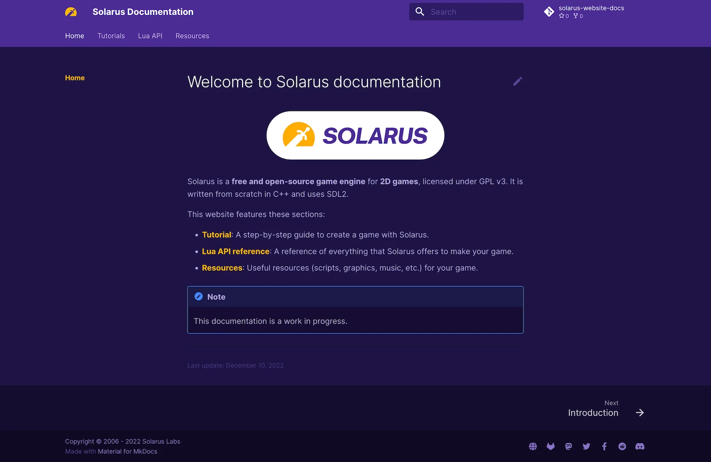

<div align="center" style="margin-bottom: 1em;">
  
</div>

# Solarus Documentation

[](https://www.gnu.org/copyleft/gpl.html)
[](https://gitlab.com/solarus-games/solarus-website-docs)

Source code for the **documentation** of the [Solarus game engine](https://www.solarus-games.org/), built with [Material for MkDocs](https://squidfunk.github.io/mkdocs-material/).

<div align="center">
  
</div>

## 📦 Setup

First, install `mkdocs` and plugins:

```bash
pip install mkdocs-material
pip install mkdocs-git-revision-date-localized-plugin
```

To run the website locally, go to the website directory, then type:

```bash
mkdocs serve
```

## 🛠️ Build

To build the website to the `/public` directory, ready to be deployed:

```bash
rm -rf ./public
mkdocs build --site-dir public
```

## ⚖️ License

The source code of Solarus documentation is licensed under the terms of the [GNU Free Documentation License v3](https://www.gnu.org/licenses/fdl-1.3.html) (GFDL v1.3).
