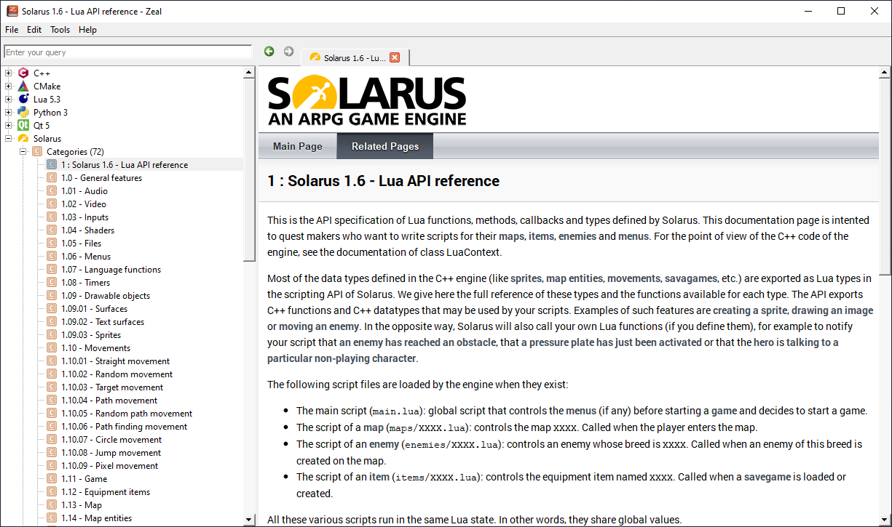

# Zeal

## What is Zeal

[Zeal](https://zealdocs.org/) is an offline documentation browser for software developers. It is the free and open-source equivalent for MacOS' Dash. It allows you to download, explore and search into a large set of technical documentations.

## Adding Solarus docset to Zeal

Zeal does not feature, by default, all the existing documentations. The less popular projects like Solarus are not present in the official docset list.

However, Zeal allows to add user-contributed docsets. One was made for Solarus. To install Solarus docset, follow these steps:

1. Go to [Zeal User-Contributions](https://zealusercontributions.vercel.app).
2. Look for Solarus, and copy the [XML url](https://zealusercontributions.vercel.app/api/docsets/Solarus.xml).
3. In Zeal, click on **Tools > Docsets... > Installed > Add feed**.
4. Paste the URL and click **OK**.
