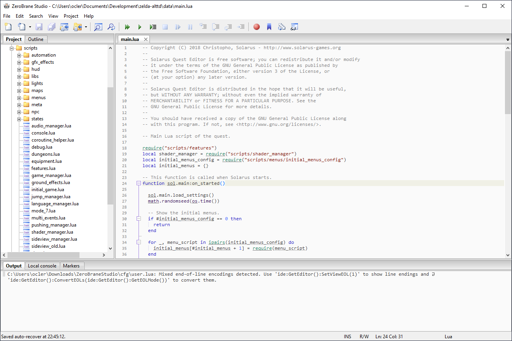

# ZeroBrane

## ZeroBrane Studio

[ZeroBrane Studio](https://studio.zerobrane.com/) is a Lua code editor and debbugger written in Lua. It includes the mobdebug library that allows any Lua script to be remotely debugged, including Solarus quests.



## Solarus plugin for ZeroBrane Studio

The Solarus plugin consists of three files (this may change in the future) to be placed in the `packages` directory of your ZeroBrane installation. See [Documentation](https://github.com/pkulchenko/ZeroBranePackage#installation) for the exact path depending on your installation.

You can download the files [on Gitlab](https://gitlab.com/solarus-games/solarus/tree/dev/work/ZBStudioPlugin).

1. `solarus.lua` is the main plugin and it registers the Solarus "interpreter" and API into ZeroBrane.

2. `solarus_lua_api.lua` is the documentation file (generated by `scrap_doc.py`).

3. `solarus_pretty_printers.lua` is loaded by Solarus when debugging. It allows exploring Solarus values in the stack as if they where tables.

Once these 3 files are installed in the `packages` directory, you can activate the Solarus plugin in ZeroBrane by selecting **Project > Lua interpreter > Solarus**.

**Note**: On Windows, the user package directory is usually in `C:\Users\<username>\.zbstudio\packages`. You have to create this folder and paste the 3 files there.

## Run your quest from ZeroBrane Studio

To be able to run your quest or debug it from ZeroBrane Studio, ZeroBrane has to find your `solarus-run` executable.

If it is in your `PATH`, you are all set. Otherwise, you can tell ZeroBrane where Solarus is by adding this line in **Edit > Preferences > Settings:User**

```lua
--user.lua
...
ide.solarus_path = [[<path to solarus-run>]] -- without the < > of course
```

## Use ZeroBrane as text editor from Solarus Quest Editor

You can tell Solarus Quest Editor to use ZeroBrane to edit Lua scripts, instead of the default internal code editor.

In Solarus Quest Editor, go to **Tools > Options > Text Editor** and enable **External Editor**.
In the command field, put `<path_to_zbstudio> "%p/data/" "%f"`. On Linux or Mac OS X, `<path_to_zbstudio>` can be as simple as `zbstudio`.

Windows users can either add `zbstudio.exe` to their `PATH` or paste the full path of the executable.
