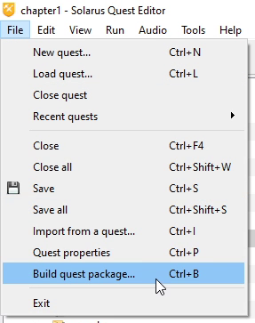
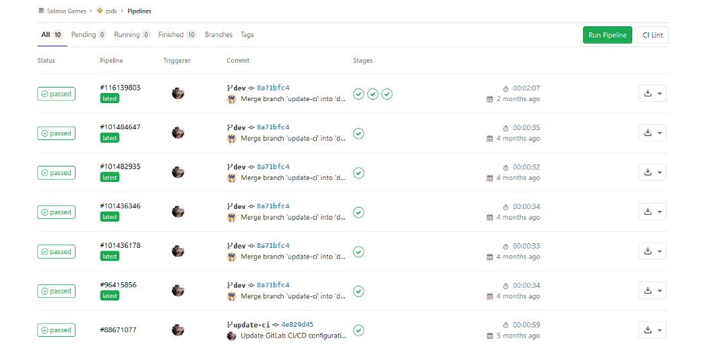
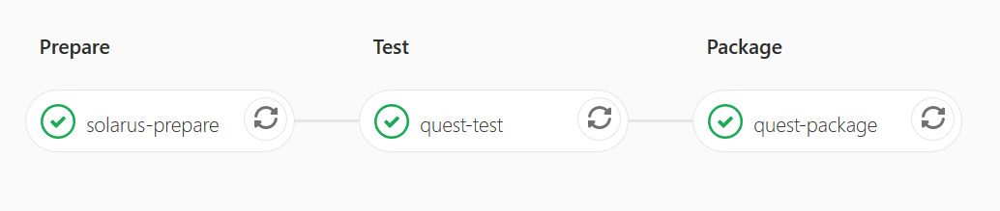

# Building a quest package

To distribute your game to players, Solarus offers a convenient way: your quest can be packaged as a single `.solarus` file. This is actually a **Zip archive** that contains all that is needed for Solarus to run your quest. See it a bit like a ROM file for which Solarus would be an emulator. Players can then launch your quest with Solarus Launcher or `solarus-run`.

## From Solarus Quest Editor

Solarus Quest Editor can build the quest package with the **File > Build quest package...** menu (<kbd>Ctrl</kbd>+<kbd>B</kbd> keyboard shortcut).



Choose the path where you want to export the package, and click on **Build**. It will generate the `.solarus` file.

## Manually

Since a `.solarus` file is basically a `.zip` file, with just a different extension, nothing prevents you to create the package manually.

From the command-line, ensure to have `zip` installed, then compress the `data` folder and all its content into a Zip file, which you can directly set the correct `.solarus` extension.

```bash
zip -r your-quest.solarus path/to/your/quest/data
```

## With GitLab CI

Your quest package can be automatically built by [GitLab CI](https://docs.gitlab.com/ee/ci/README.html) if you host your quest's repository on GitLab. The build pipeline will be triggered every time you create a new tag or a commit that modify files in the `data` folder.



You just need to add a file named `.gitlab-ci.yml`, at the root of your repository, that contains these lines:

```yaml
include:
  - https://gitlab.com/solarus-games/solarus-devops/raw/master/gitlab/quests.yml
```

This script will take care of creating the jobs, running tests if possible, and generating the artifacts, that won't expire after creation, i.e. you can use these links to allow people to download your quests.



The generated packages are named `<project-name>-<commit-hash>.solarus` for non-releases (based on commits) or `<project-name>-<tag-name>.solarus` for releases (based on tags).

Here is how you can get a direct donwload from GitLab for quest releases (based on tags):

```txt
https://gitlab.com/<username>/<quest-name>/-/jobs/artifacts/<tag>/raw/<quest-name>-<tag>?job=quest-package
```

Where:

- `<username>` is your GitLab username.
- `<quest-name>` is the repository name of the quest.
- `<tag>` is the tag name.

For example:

```txt
https://gitlab.com/jean-pierre/legend-of-zora/-/jobs/artifacts/v1.3.2/raw/legend-of-zora-v1.3.2?job=quest-package
```
