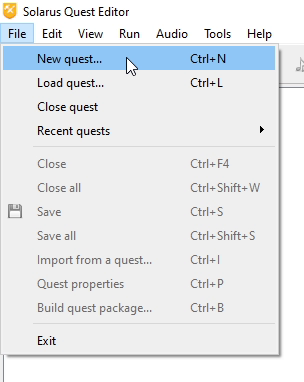
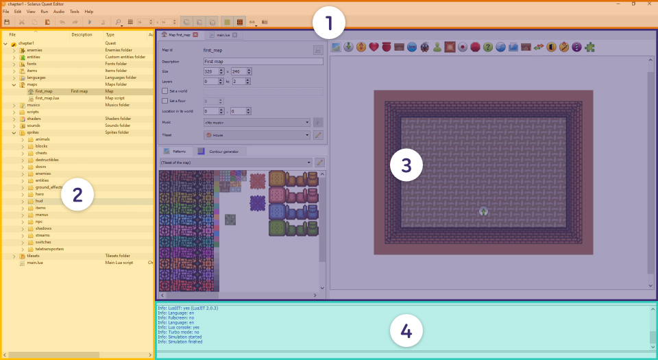
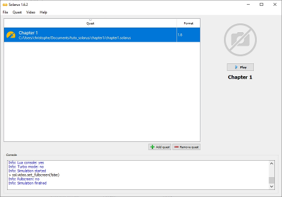

# Creating a quest

## Creating a new Solarus quest

Open Solarus Quest Editor. Since this is the first launch, there is no quest yet. You can create a new one with the **File > New quest...** menu. A popup dialog will open, asking for the location of your quest. Create a new folder called `your-quest-name` (for instance) where to save your quest to.



The basic skeleton of a Solarus quest is then generated in the `your-quest-name` folder, and looks like this. These folders already contain basic examples for each content: note that this Solarus quest is already ready to be run, without any more configuration.

```txt
📂 your-quest-name
└─ 📂 data
  └─ 📂 enemies
  └─ 📂 entities
  └─ 📂 fonts
  └─ 📂 items
  └─ 📂 languages
  └─ 📂 maps
  └─ 📂 musics
  └─ 📂 scripts
  └─ 📂 shaders
  └─ 📂 sounds
  └─ 📂 sprites
  └─ 📂 tilesets
  └─ 📄 main.lua
  └─ 📄 project_db.dat
  └─ 📄 quest.dat
```

The content of each folder will be explained in a further chapter. Let's still detail what are the 3 files at the root:

- `main.lua` is the starting point for your game. You'll be able to edit this Lua script to configure how your game starts.

- `quest.dat` contains your project metadata (title, author, screen size, Solarus required version, etc.). It is not visible in Solarus Quest Editor's file tree, because usually you don't edit it manually. Metadata are edited with the **File > Quest properties** menu (`Ctrl+P`) or by right-clicking on your quest's top item in the file tree.

- `project_db.dat` is a file that contains all information about how your resources are configured. Usually, you never have to edit it manually. This file is automatically modified by Solarus Quest Editor when you edit a map, a sprite or any resource.

## Solarus Quest Editor's main window

The Solarus Quest Editor window is divided in 4 main parts. Here is a quick overview.



1. **Toolbar:** Main functions of the app.
2. **Quest tree:** Displays the quest files. It's not exactly the filesystem tree, but close to it.
3. **Tabs and workspace:** This is where the different tabs open, and where you are able to edit your files with the multiple editors included in Solarus (map editor, sprite editor, script editor, etc.).
4. **Console:** Displays the game's output.

## Running a quest

### With Solarus Quest Editor

To run a quest when you're developing it, you can hit the `F5` key or press the "play" button.


The quest will start in a separate window. Output will be displayed in the console at the bottom of the window, which is really useful for debugging.

### With Solarus Launcher

For the majority of players, who don't like using the command-line, Solarus Launcher provides a convenient way to launch quests. Players have to add a quest (a `.solarus` file or `quest.dat` file) to the quest library managed by Solarus Launcher, with the **Add Quest** button, select it, and click on **Play** (or hit `Enter`).

Here too, the game's output will be printed to the built-in console. It allows players to give you some useful information about bugs or errors.



### With solarus-run

`solarus-run` is the command-line program to start a Solarus quest, that you pass as an argument. It is able to actually launch a Solarus quest from two types of input parameters:

1. From a `.solarus` file, which is the recommended way of distributing your quest to players.

      ```bash
      solarus-run path/to/your/quest.solarus
      ```

2. From a folder where it finds a `data/quest.dat` or `quest.dat` file.

      ```bash
      solarus-run path/to/your/quest
      ```
