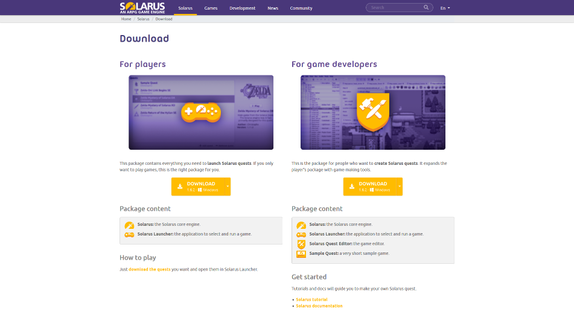
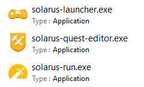
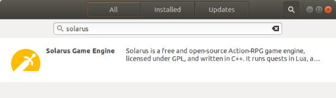
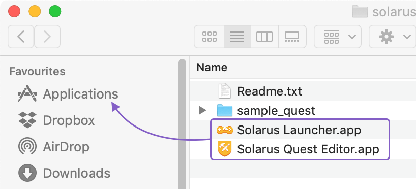

# Installing Solarus

## Download

You need first to install Solarus on your computer to be able to develop a game with it. Go to the [Solarus download page](https://www.solarus-games.org/download).



On the left side is the installation package for the players. They will need it to be able to play your game. As a quest developer, you don't need it because it is already included in the developer package.

On the **right side**, you'll find the **developer installation package**. This is what you need. Select your OS and follow the instructions in the popup that will show up.

| File name                | Description                                                                                                   |
| ------------------------ | ------------------------------------------------------------------------------------------------------------- |
| **Solarus**              | The game engine itself.                                                                                       |
| **Solarus Quest Editor** | The development environnement you'll use to create and edit the game's resources like maps, sprites or texts. |
| **Solarus Launcher**     | An app to launch quests (intended for players).                                                               |
| **Sample Quest**         | A very short Solarus quest, intended to be an example.                                                        |

### Windows

Currently, there is **no installer**. The package is just a Zip file containing all that you need. Unzip it to reveal its content. Note that you can move the `solarus/` folder where you want.



What you need to launch to start developing your Solarus quest is `solarus-quest-editor.exe`. See how to do it in the next chapter.

!!! note

    This is what is called a _portable_ app: you can launch it from wherever you want. The downsides are that the app isn't perfectly integrated into the OS: you won't find it in the Start Menu, for instance. We're working on that.

### Linux

Solarus is available in the Snap Store. Look for `solarus` and you will get the Solarus developer package (Solarus Quest Editor, Solarus Launcher, solarus-run).



You can also install it with a terminal. First, ensure you have **snapd** installed. If not, [install it with your package manager](https://docs.snapcraft.io/installing-snapd/6735) It should be something like (for Ubuntu, as instance):

```bash
sudo apt install snapd
```

Then, install **Solarus**.

```bash
sudo snap install solarus
```

### Mac OS X

There is **no installer** on MacOS. The `.zip` package contains two `.app` bundles: Solarus Quest Editor and Solarus Launcher, along with the Sample Quest. You need to drag and drop these `.app` bundles to the **Applications** folder.



!!! note

    Currently, the MacOS package does not contains a `.app` for **solarus-run** because this is a command-line program, that does not have a GUI. To be able to execute it in the terminal, you need to type:

    ```bash
    /Applications/Solarus Launcher.app/Content/Resources/solarus-run path/to/your/quest
    ```
