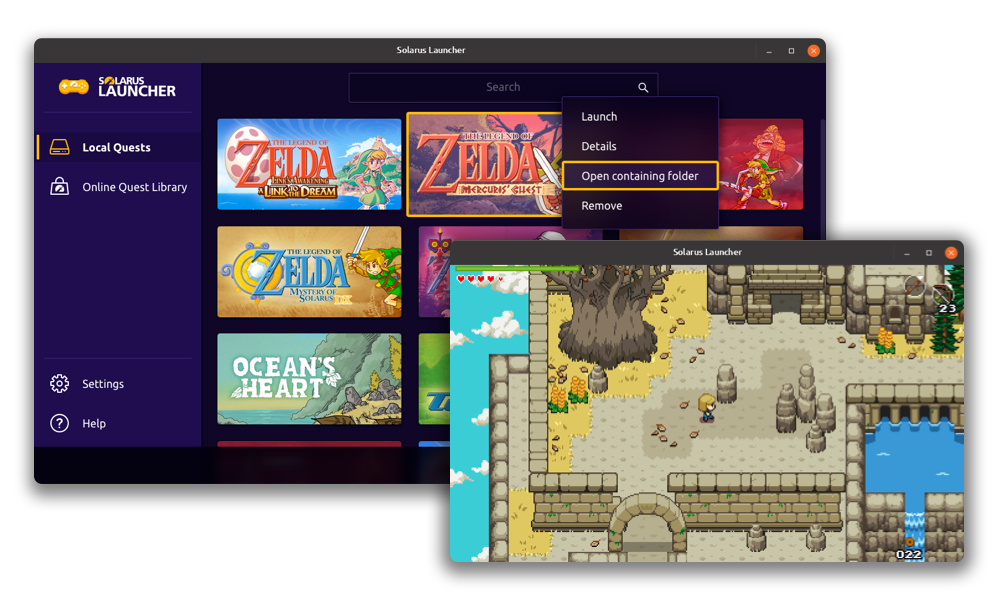

# Introduction

## What is Solarus

Solarus is a **free and open-source game engine** for **2D games**, licensed under GPL v3. It is written from scratch in C++ and uses SDL2. Consequently, it is compatible with a large set of platforms. You can [explore the source code](https://gitlab.com/solarus-games) if you're curious.

The engine itself does not contain any copyrighted code or assets. Thus, Solarus cannot be eligible for a DMCA from anyone, including Nintendo.

## What is _not_ Solarus

- **A Super Nintendo™ emulator**: It is a game engine.
- **A *The Legend of Zelda: A Link To the Past*™ ROM hack**: _A Link To The Past_ assets (tilesets, sprites, musics, etc.) are totally separated from the engine (the engine does not contain them).
- **A _Zelda_ engine**: It can power any Action-RPG or Action-Adventure game (or any kind of game you want, with a little more work).
- **A no-code game editor**: You will need to code (in Lua) to specify the game's logic, unlike RPG Maker. However, Solarus provides a graphical editor to create maps and sprites.

## What has Solarus to offer

Solarus is a very lightweight engine, and is very easy to develop with.

- A **C++ engine** that handles all the heavy computation (graphics, collisions, etc.). You won't have to dig into the C++ code.
- A **Lua API** built for **Action-RPG or Action-Adventure games** in mind (maps, items, enemies, treasures, etc.)
- Solarus games are **cross-platform** (Windows, Linux, macOS, Android, iOS, etc.)
- Solarus games are packaged as `.solarus` files, which are **easy to distribute**.
- An IDE named **Solarus Quest Editor** that allows to graphically edit maps, sprites, Lua scripts, etc.
- A game launcher name **Solarus Launcher** that players can use to launch Solarus games, a bit like an emulator.

!!! success "Get started in game dev with Solarus!"

    Solarus is a good tool to start learning how to code and to make games: Lua is a simple-to-learn and powerful language that is widely used in the video game industry.
