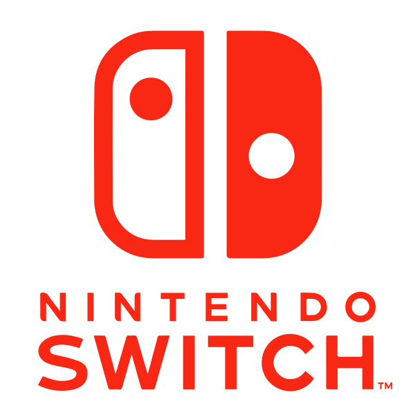

# Nintendo Switch™

## Solarus on Switch

Solarus has been ported to Nintendo Switch, and at least one game using this port has been released on this system: [Ocean's Heart](https://www.nintendo.com/store/products/oceans-heart-switch/).

**The Nintendo Switch port of Solarus is kept private**, though, even if Solarus is free and open-source software.

This is because of Nintendo's **Non-Disclosure Agreement**. They don't release their development kit as open-source software, so we can't make the port's source code public. It's the law.

However, the Nintendo Switch repository does not contain anything more than **slight modifications to make it build and run on Switch**. We made sure that the public repository has benefited from all the general-purpose improvements made in the private Switch one.

If you want to release your game on Switch, you need to get access to the **Nintendo Development Kit**.

## How to get a Development Kit

To get a **Nintendo Switch Development Kit** (software and hardware), you need to get in relation with a publisher that has an agreement with Nintendo, or Nintendo themselves (but it's harder if you're a small and unknown indie dev).

You will have to sign a **Non-Disclosure Agreement** (NDA) that imposes that you will keep all the information about Nintendo Development Kit **secret**.

What you will get:

- The software tools to build a game for Nintendo Switch.
- The hardware (a specialized Nintendo Switch) to debug the game directly on the system.
- Access to private forums to speak with other Nintendo Switch devs.

## And then?

Once you have signed this paper, you can show it us and we will give you access to the Solarus Switch port repository. Contact the Solarus Team on [Discord](https://discord.gg/yYHjJHt).

The process to build a Solarus game for Switch is explained in this repository.

!!! success "Summary"

    How to get your game on Nintendo Switch:

    1. Get access to the Nintendo Devlopment kit.
    2. Ask the Solarus Team to get access to the private Nintendo Switch port of Solarus.
