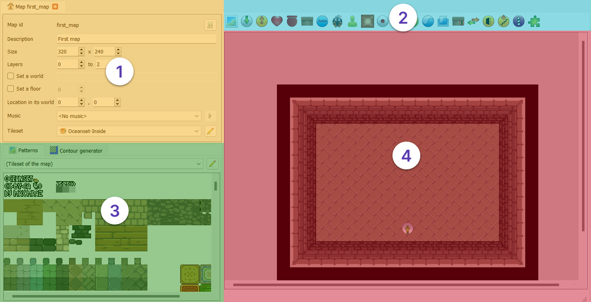
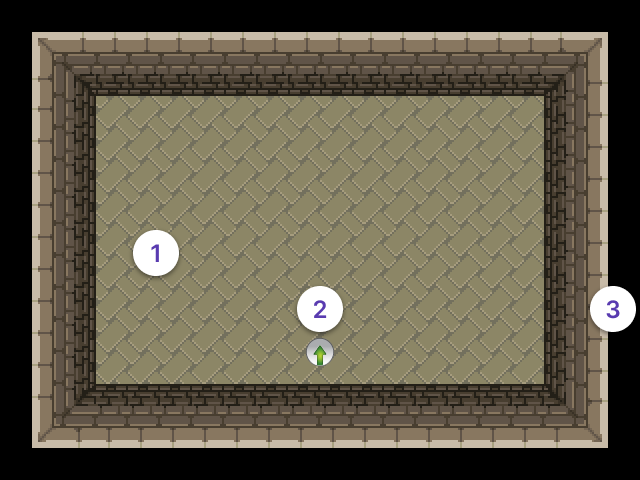
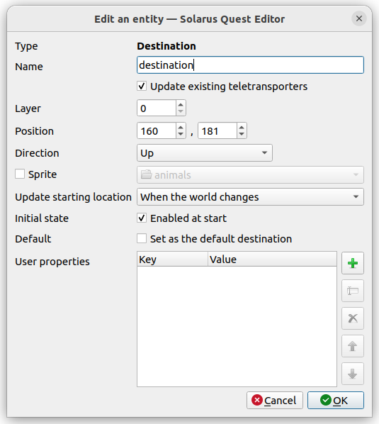
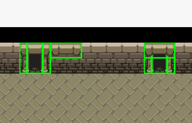
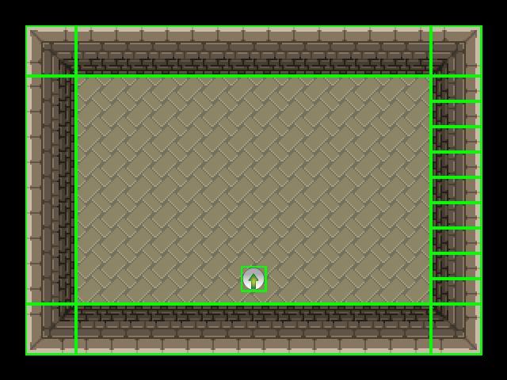

# The Map Editor

## Overview

In this tutorial we will be discussing the map editor. This is, in many ways, the main editing tool within the Solarus Editor.

Maps are the space the player operates within while playing the game. They can represent houses, dungeons, the overworld field or a part of any of those.

We will be going over the main features of the editor, along with the basics of how to view and edit maps with it.

## User Interface

The map editor is divided into four main sections.

1. **Property Panel:** Controls properties of the map.
2. **Entity Toolbar:** Lets you create new [entities](#entities) to put on the map.
3. **Tileset View:** Is used to access the tileset and create new [tiles](#tiles).
4. **Map View:** Is where you view and edit the layout of the map itself.

### Property Panel

On the left side of the map editor, you will see the map properties panel, which contains the properties defined on the whole map.

| Property          | Role                                                                                                 |
| ----------------- | ---------------------------------------------------------------------------------------------------- |
| Map Id            | A unique identifier for the map within the quest. It comes from the file name and cannot be changed. |
| Description       | Any text to help describe the map. Not visible to the player.                                        |
| Size              | The `width` and `height` of the map. You may resize the map here in increments of 8.                 |
| Layers            | The range of layers in the map.                                                                      |
| World             | Maps can optionally be part of a world.                                                              |
| Floor             | The floor (or height) of the map within the world. Useful for buildings.                             |
| Location in world | The `x` & `y` position of the map within the world.                                                  |
| Music             | Music to play when the player enters the map.                                                        |
| Tileset           | The default tileset to draw map tiles from.                                                          |

### Keyboard Shortcuts

| Action           | Shortcut                                              |
| ---------------- | ----------------------------------------------------- |
| Panning the view | Hold down the middle mouse button and move the mouse. |
| Zooming          | <kbd>CTRL</kbd> + Mouse wheel.                        |

## The Default First Map

This example is `first_map`, which is included by default with a new quest.

1. The walls and floor are made up of **tiles**, which we will be going over in more detail later in this tutorial.

2. The grey circle with the green arrow is a **destination**. This will disappear while the game is running, but sets the hero's starting location.

3. The black area around the edge of the map isn't anything. Quite literally, it is just area inside the map that has no entities in it. You can still see this area while playing (unlike the white area around it in the editor, which will not appear in game), so cover it up if you don't like the look of it.

## Entities

Other than its basic properties, a map is defined by the entities on it.

An entity can be **anything that has a particular location on the map**. There are many more types of entities than we will be covering during this tutorial.

### Entity Properties

To edit the properties of an entity, there are two ways:

- Right-click on an entity will bring up a context menu. From there you can click on **Edit**.
- Select an entity, and press <kbd>Enter</kbd>.

This is one possible property editor, each type has different properties available. This one is the one for destinations, but if you open a tile's properties, you will see something else.

Still, all entities will have common properties: **Type**, **Layer** and **Position**.

| Property | Role                                                                                          |
| -------- | --------------------------------------------------------------------------------------------- |
| Type     | What kind of entity you are looking at.                                                       |
| Position | The entity's position on the map, broken into `x` (horizontal) and `y` (vertical) components. |
| Layer    | The entity's layer on the map.                                                                |

You can edit these fields to move an entity to an exact location, although both values must be a multiple of 8, but usually it is easier to click and drag an entity around in the map view.

Each map is divided into layers. By default, a map contains 3 layers, numbered 0, 1 and 2.

Usually, **entities only interact with other entities on the same layer**, and will pass under things on higher layers and over things on lower layers.

There are some simple uses of layers in this tutorial, but more advanced uses, like creating bridges, will be covered later.

## Tiles

Tiles are probably the simplest and most common type of entity. They can be seen as little bricks used to create the landscape of the map.

### Using Tiles

Tiles can be created by pressing the **Add Tile** button at the left side of the entity toolbar, but it is generally easier to use the tileset view in the bottom left.

As you can see, the panel shows two tabs: **Patterns**, and **Contour Generator**. In this tutorial, we will just be using the Patterns tab.

The Patterns tab shows the tileset in full, and can be navigated like the map view.

A **pattern** is a part of the tileset that will become a tile, so click on any part of the tileset that looks like a thing to put on a map and you should get an outline around the pattern you clicked on. Then click on the map view to place a tile made from that pattern there.

You can also click and drag to select multiple patterns at once and create multiple tiles at once. Tilesets can arrange the patterns for common groups of tiles together to make use of this.

Tiles also have a **Z-order within their layer**. Generally, this is only important when tiles overlap in which case the front most tile will take priority.

### Keyboard Shortcuts

| Action                                     | Shortcut     |
| ------------------------------------------ | ------------ |
| Resizing                                   | <kbd>R</kbd> |
| Moving to the front (Z-order in the layer) | <kbd>T</kbd> |
| Moving to the back (Z-order in the layer)  | <kbd>B</kbd> |

### Doors: A Concrete Use of Tiles and Layers

The door on the left shows how you might pull the tiles out as a group. Just move the top of the door frame over to get the door on the right.

Both of these doors are on top of the wall, and override the wall so the player can walk through them.

The top of the frame is also on a higher layer, so that the player will walk under it when they pass through the door.

The context menu has all the controls for both layer and order within layer.
You can move it to any layer, the layer options will move the tile to that layer, its current layer will be "selected" with a dot.

Within a layer, entities are sorted by their Z-Order, where they are drawn front to back. You can reorder entities by moving an entity to the front or back of the layer, either using the context menu or the shortcuts <kbd>T</kbd> or <kbd>B</kbd>.

### Resizing Tiles

Tiles can also be resized, either through the context menu or by pressing <kbd>R</kbd> while the tile is selected.

The height and width of the tiles must always be a multiple of 8, but other than that, individual tiles can decide if they can be resized horizontally, vertically, both or neither, depending on what makes sense for what the tile shows.

Here is a version of the `first_map` with everything selected. The one change made is the right wall has been broken up, one resized tile has been replaced with a series of the same tile, this is why it is covered in outlines. While the game is running, these two patterns will look, and generally act, the same, but a single resizeable tile is much easier to manage.

Groups of tiles can also be resized together. If you see a 3-by-3 grid or ring of tiles this can be used like a single large tile with trim. The starting room (not the modified version in the last example) actually is already layed out this way.

How a tile can be resized is controlled by the tile's pattern. The pattern also decides things like if the hero can walk over the tile. Further information on tilesets and patterns will come in a later tutorials, along with information about many other types of entities and how to use the properties of the map.
